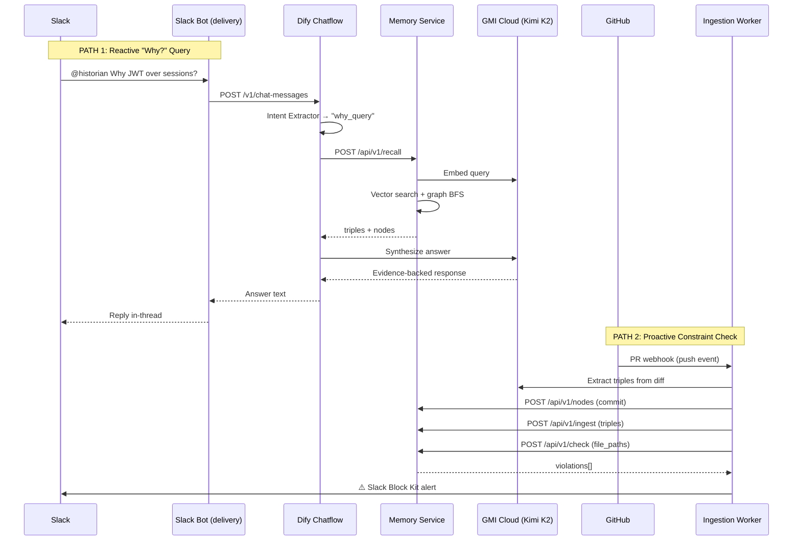

# PROJECT SPEC: The Engineering Historian
**Codename:** ContextCortex  
**Target:** Total Agent Recall Hackathon  
**Last Updated:** 2026-03-28  

---

## 1. Problem Statement

**"Architectural Amnesia"** — Engineering teams make hundreds of decisions per sprint across Slack threads, PR reviews, and meetings. Within 2 weeks, the *why* behind those decisions is forgotten. Onboarding engineers blindly refactor code that was intentionally designed that way. Standard RAG is stateless — it retrieves text, not relationships.

### What We're NOT Building
- ❌ A chatbot that searches docs
- ❌ A RAG pipeline with a vector DB
- ❌ A meeting summarizer

### What We ARE Building
- ✅ A **Relational Recall Engine** that models decisions as graph triples
- ✅ A **Proactive Guardrail** that flags code changes violating historical decisions
- ✅ A **"Why Engine"** that traverses the decision graph to answer "Why was X built this way?"

---

## 2. The Stack (Non-Negotiable)

| Layer | Tech | Role | Endpoint |
|:------|:-----|:-----|:---------|
| **Brain** | GMI Cloud (H100) | Low-latency inference via Kimi K2.5 | `https://api.gmicloud.ai/v1/chat/completions` |
| **Memory** | HydraDB (Cortex) | Relational graph triples + vector hybrid | `https://<project>.hydradb.com/v1/` |
| **Orchestration** | Dify v1.13+ | Multi-agent chatflow via YAML DSL | Self-hosted `http://dify:3000` |
| **Interface** | Photon Spectrum | Unified messaging (Slack/iMessage/WhatsApp) | `https://api.photon.codes/v1/` |
| **Queue** | Redis 7+ | Ingestion queue + rate limiting | `redis://redis:6379` |

---

## 3. Core Logic: Relational Recall

### 3.1 Triple Model
Every piece of engineering context is stored as a **subject-predicate-object** triple in HydraDB:

```
(Decision:auth_jwt_over_sessions) -[MADE_BY]-> (User:shanyu)
(Decision:auth_jwt_over_sessions) -[DISCUSSED_IN]-> (Thread:slack_441)
(Commit:8a2f3b) -[RESOLVES]-> (Decision:auth_jwt_over_sessions)
(Commit:c7d4e1) -[VIOLATES]-> (Decision:auth_jwt_over_sessions)
(Decision:no_shared_session_store) -[SUPERSEDES]-> (Decision:legacy_cookie_auth)
```
Timestamps are stored as `extracted_at` on edge metadata and `created_at` on nodes — not as separate triples.

### 3.2 The "Why" Query Path (Reactive — through Dify)
```
Developer asks: "Why do we use JWT instead of sessions?"
  → Slack bot receives mention → POST to Dify API /v1/chat-messages
  → Dify Code Node classifies intent as "why_query"
  → Dify HTTP Node → Memory Service POST /api/v1/recall
  → Memory Service: embed query → vector search → graph BFS (depth 3)
  → Returns: triples + connected nodes (Decision, Thread, User)
  → Dify LLM Node (Kimi K2): synthesizes evidence-backed answer
  → Dify Answer → Slack bot posts reply in-thread
```

### 3.3 The Proactive Check Path (Automated — bypasses Dify)
```
Developer pushes PR on GitHub
  → GitHub webhook → Ingestion Service /github endpoint
  → Worker extracts triples via Kimi K2 + stores via Memory Service /ingest
  → Worker THEN calls Memory Service POST /api/v1/check with PR file_paths
  → Memory Service: find decisions constraining those file paths
  → If violations found: Worker sends Slack Block Kit alert directly
  → Alert includes: decision title, author, date, thread link, recommendation
```

> **Key distinction:** The "Why" path runs through Dify (interactive chatflow). The proactive check path runs through the ingestion worker directly (automated pipeline). These are two separate flows that share the memory service.

---

## 4. Data Sources (Ingestion)

| Source | Method | Extracted Triples |
|:-------|:-------|:-----------------|
| **Slack** | Webhooks → Redis queue | (Decision)-[DISCUSSED_IN]->(Thread), (User)-[AUTHORED]->(Message) |
| **GitHub** | PR webhooks → Redis queue | (Commit)-[RESOLVES/VIOLATES]->(Decision), (PR)-[REVIEWED_BY]->(User) |
| **Meetings** | Transcript upload → GMI extraction | (Decision)-[DECIDED_IN]->(Meeting), (Action_Item)-[ASSIGNED_TO]->(User) |

---

## 5. API Contracts

### 5.1 Memory Service API (`memory-service:8000`)
```yaml
# POST /api/v1/nodes — Upsert a node (user, decision, thread, commit, meeting)
Request:
  type: enum    # "user" | "decision" | "thread" | "commit" | "meeting"
  id: string    # Unique ID, e.g. "user:shanyu"
  data: object  # Fields matching the node type schema
Response:
  node_id: string
  status: "created" | "updated"
Errors:
  422: { error: "Invalid node type or missing required fields" }

# POST /api/v1/ingest — Store a new triple
Request:
  subject: { type: string, id: string }
  predicate: string  # MADE_BY, DISCUSSED_IN, RESOLVES, VIOLATES, etc.
  object: { type: string, id: string }
  metadata: { source: string, timestamp: string, confidence: float }
Response:
  triple_id: string
  status: "created" | "updated"
Errors:
  422: { error: "Subject or object node does not exist" }
  422: { error: "Invalid predicate type" }

# POST /api/v1/recall — Query the decision graph
Request:
  query: string            # Natural language or structured
  scope:
    types: [string]        # Node types to search
    depth: int             # Graph traversal depth (default: 3, max: 5)
    time_range: [string, string]?  # ISO timestamps, nullable
Response:
  triples: [{ subject, predicate, object, metadata }]
  nodes: { users: [...], decisions: [...], threads: [...] }  # Hydrated node data
  context_summary: string  # GMI-generated summary
Errors:
  503: { error: "Embedding service unavailable" }

# POST /api/v1/check — Proactive constraint check
Request:
  code_diff: string         # Unified diff format
  file_paths: [string]      # Array of affected file paths
Response:
  violations: [{ decision_id, title, description, confidence,
                 decided_by: string, decided_at: string,
                 evidence_thread: string, evidence_quote: string }]
  status: "clean" | "conflict"
Errors:
  503: { error: "Embedding service unavailable" }

# GET /health — Service health
Response:
  status: "ok" | "degraded"
  db: "connected" | "disconnected"
  embedding_service: "connected" | "disconnected"
```

### 5.2 Authentication
All memory service endpoints require `Authorization: Bearer <MEMORY_SERVICE_API_KEY>`. The key is set via environment variable. Invalid/missing key returns `401`.

### 5.2 Dify ↔ GMI Cloud
```yaml
# Standard OpenAI-compatible endpoint
POST https://api.gmicloud.ai/v1/chat/completions
Headers:
  Authorization: Bearer ${GMI_API_KEY}
Body:
  model: "kimi-k2"
  messages: [{ role, content }]
  temperature: 0.3  # Low for factual recall
```

### 5.3 Photon Delivery
```yaml
# POST https://api.photon.codes/v1/send
Headers:
  Authorization: Bearer ${PHOTON_API_KEY}
Body:
  channel: "slack"
  target: "#engineering"
  message: string
  metadata: { thread_ts: string }  # For threaded replies
```

---

## 6. Success Criteria (Hackathon Judging)

| Criteria | Target |
|:---------|:-------|
| **Stateful Memory** | Agent recalls decisions from >7 days ago |
| **Relational Recall** | Triple traversal returns connected context, not flat text |
| **Proactive Check** | Agent flags a conflicting PR within 30s of webhook |
| **Demo Impact** | "Why was this built this way?" → Agent cites person, thread, date |

---

## 7. What's Out of Scope (v1)

- ❌ Multi-tenant isolation (single-team demo)
- ❌ Fine-grained RBAC on graph access
- ❌ Real-time streaming (batch ingestion is fine)
- ❌ iMessage/WhatsApp (Slack-only for demo)
- ❌ Custom Dify plugins (HTTP Request nodes only)

---

## 8. Risk Register

| # | Risk | Probability | Impact | Mitigation |
|:--|:-----|:-----------|:-------|:-----------|
| 1 | HydraDB SDK undocumented/broken | Medium | High | `MemoryBackend` protocol — swap to Postgres silently |
| 2 | GMI Cloud rate limits during demo | Low | Critical | Cache demo queries in Redis; pre-warm model |
| 3 | Dify DSL import version mismatch | Medium | Medium | Manual import fallback; pin Dify version |
| 4 | Triple extraction quality is low | High | High | Hand-tuned prompt + confidence threshold (>0.7) |
| 5 | Slack webhooks need public URL | High | Medium | ngrok tunnel in dev; document in README |
| 6 | Docker network isolation (Dify vs our stack) | Medium | Medium | Use `host.docker.internal` for cross-stack calls |
| 7 | Embedding dimension mismatch | Medium | High | Configurable `EMBEDDING_DIM` env var; verify on startup |

---

## 9. System Architecture (Data Flow)


